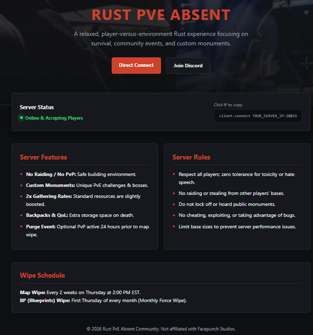

# Rust PvE Absent — Community Hub

Welcome to the official repository for **Rust PvE Absent**. This repository hosts our community landing page via **GitHub Pages** and serves as an informational hub for server rules, features, and wipe schedules.

---
## 📸 What it looks like

---

## 🛠️ How to Enable GitHub Pages

Follow these simple steps to activate the site on your own repository:

1. Push `index.html` and `README.md` to your repository's `main` or `master` branch.
2. On GitHub, navigate to your repository's **Settings**.
3. Under the **Code and automation** section in the left sidebar, click on **Pages**.
4. In the **Build and deployment** section under **Branch**:
   - Select `main` (or `master`) from the drop-down menu.
   - Select `/ (root)` as the folder.
5. Click **Save**.
6. Wait 1–2 minutes for the site to build. Your URL will appear at the top of the page.

---

## 📝 Customization Instructions

Before publishing, open `index.html` and update the following placeholders with your actual server information:

* Replace `YOUR_SERVER_IP:28015` with your server IP and port.
* Replace `https://discord.gg/YOUR_DISCORD_LINK` with your active Discord invite link.
* Adjust the **Wipe Schedule** and **Server Features** in the HTML markup to match your server configuration.

---

## 🎮 How to Join the Server

Players can join our server using either of these two methods:

### Method 1: Direct Connect Link
Click the **Direct Connect** button on our website, or click here:
`steam://connect/YOUR_SERVER_IP:28015`

### Method 2: In-Game Console
1. Launch Rust.
2. Press `F1` to open the developer console.
3. Type or paste:
   ```text
   client.connect YOUR_SERVER_IP:28015